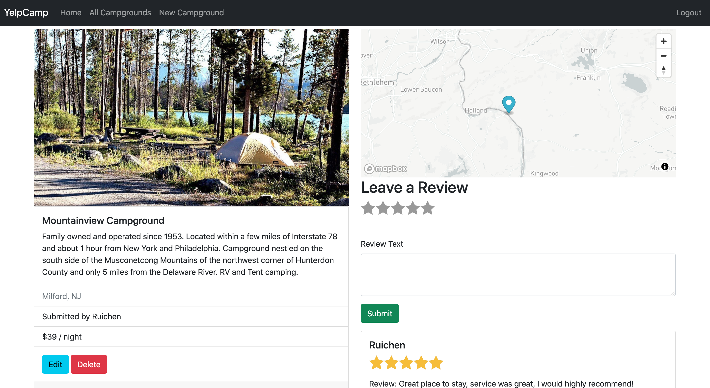

# YelpCamp

Project Date: March 2021

## Description

 

YelpCamp is a fullstack responsive website where users can share camping experiences by creating campgrounds and leaving reviews.

This project was part of a fullstack web development course on [Udemy](https://www.udemy.com/course/the-web-developer-bootcamp/) instructed by Colt Steele.

## Tech Stack

- Frontend: HTML, CSS, Bootstrap, JavaScript, AJAX
- Backend: Node, Express, MongoDB
- User Authentication: PassportJS
- Cloud Storage: Cloudinary
- Map: Mapbox
- Deployment: Heroku

## Main Features

 

- User authentication: Sign up, log in, and log out functions are available for account creation and access.
- Campground creation: Logged-in users can create, manage, and update campgrounds, including details such as name, description, location, price, and images.
- Reviews: Logged-in users can leave comprehensive reviews, complete with star ratings, and delete their own reviews as needed.
- Maps: A comprehensive cluster map of all campgrounds is available, along with a detailed map of each campground on its dedicated page for easy navigation.
